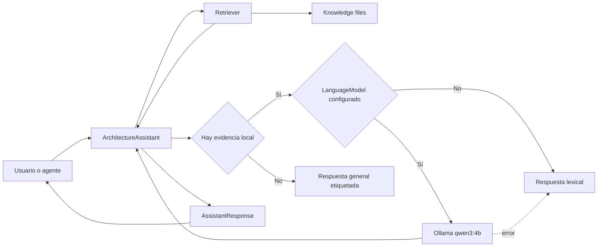

# Arquitectura

## Propósito

El Architecture Assistant aplica Retrieval-Augmented Generation (RAG) para
responder preguntas de arquitectura usando conocimiento almacenado localmente.
La recuperación y la generación están separadas para que cada parte pueda
evolucionar y probarse de manera independiente.

## Flujo



## Componentes

### `app/retriever.py`

Responsable de:

- leer archivos de conocimiento;
- dividir documentos en chunks de hasta 120 palabras con 20 de solapamiento;
- clasificar temas mediante palabras clave;
- puntuar coincidencias de pregunta, contexto, fuente y tema;
- devolver resultados ordenados y explicables.

No depende de Ollama. Puede utilizarse solo o sustituirse más adelante por un
retriever híbrido que combine búsqueda lexical y embeddings.

### `app/models.py`

Define el protocolo `LanguageModel`:

```python
def generate(system_prompt: str, user_prompt: str) -> str:
    ...
```

`OllamaModel` implementa ese contrato mediante la API HTTP local de Ollama.
La aplicación no depende directamente de una familia concreta de modelos.
Otro runtime puede implementar el mismo protocolo.

### `app/assistant.py`

`ArchitectureAssistant` es el núcleo de la aplicación. Sus tareas son:

1. recuperar los chunks más relevantes;
2. construir un prompt con pregunta, contexto y fuentes;
3. invocar opcionalmente al modelo;
4. aplicar fallback si el modelo falla;
5. devolver un `AssistantResponse` estructurado.

`AssistantResponse` contiene:

- `content`: respuesta;
- `sources`: documentos utilizados;
- `generated_by_model`: indica si intervino el LLM;
- `answer_mode`: procedencia de la respuesta;
- `warning`: problema recuperable, por ejemplo Ollama detenido.

Los modos actuales son:

- `grounded`: Qwen redactó usando fuentes locales;
- `general`: Qwen respondió desde su conocimiento general, sin fuente local;
- `retrieval`: se mostró directamente el resultado lexical;
- `retrieval_fallback`: Ollama falló y se utilizó retrieval;
- `no_match`: no hubo fuente local ni respuesta de modelo.

Este objeto estructurado evita que futuros consumidores tengan que analizar
texto de terminal.

### `app/main.py`

Es un adaptador de terminal. Gestiona comandos, memoria y configuración, pero
no contiene la lógica RAG principal.

## Configuración

La selección se realiza con variables de entorno:

| Variable | Default | Función |
| --- | --- | --- |
| `LOCAL_AI_PROVIDER` | `ollama` | `retrieval` u `ollama` |
| `OLLAMA_MODEL` | `qwen3:4b` | Modelo local |
| `OLLAMA_BASE_URL` | `http://localhost:11434` | API local |

## Decisiones actuales

### Retrieval antes que generación

El LLM no elige libremente el conocimiento. El código recupera primero los
fragmentos y el modelo recibe únicamente ese contexto. Esto mejora
trazabilidad y permite evaluar retrieval sin confundirlo con la calidad de
redacción.

### Respuesta general explícita

Cuando la pregunta no coincide con ningún documento, Qwen puede responder
desde su conocimiento incorporado. Esa respuesta no recibe fuentes y se marca
como `answer_mode: general`. Esto mejora la utilidad sin presentar conocimiento
del modelo como evidencia local.

El contexto conversacional puede mejorar el orden de resultados, pero no puede
crear por sí solo una coincidencia para una pregunta nueva.

Una coincidencia lexical tampoco garantiza que el fragmento pueda responder.
El prompt grounded exige la señal `INSUFFICIENT_CONTEXT` cuando falta evidencia.
En ese caso, el asistente descarta las fuentes y realiza una respuesta general
etiquetada, en vez de presentar una negativa como respuesta fundamentada.

Antes de invocar el prompt grounded, el asistente también calcula la cobertura
de términos significativos de la pregunta. Si los chunks cubren menos del 60%,
omite la llamada grounded y responde directamente en modo `general`. Por
ejemplo, una coincidencia con `AWS` no implica que el conocimiento local pueda
explicar `AWS Bash`.

### Fallback lexical

Una caída del runtime local no inutiliza la aplicación. El usuario recibe el
mejor resultado lexical y una advertencia operativa.

### Thinking desactivado

La petición a Qwen3 utiliza `think: false` y añade `/no_think` al prompt. En
esta etapa interesa reducir latencia y observar respuestas directas. El
adaptador también elimina defensivamente cualquier bloque `</think>` que el
runtime incluya en el contenido. Más adelante deberá compararse con thinking
activado mediante un conjunto estable de preguntas.

### Temperatura baja

Se usa `temperature: 0.2` para favorecer respuestas consistentes y reducir
variación en un dominio técnico.

## Límites actuales

- El conocimiento disponible es pequeño y general.
- El ranking es lexical, no semántico.
- La memoria guarda texto, pero no entidades ni decisiones arquitectónicas.
- No existe todavía evaluación automática de fidelidad o calidad.
- El asistente aún no está expuesto como API, skill o herramienta MCP.
